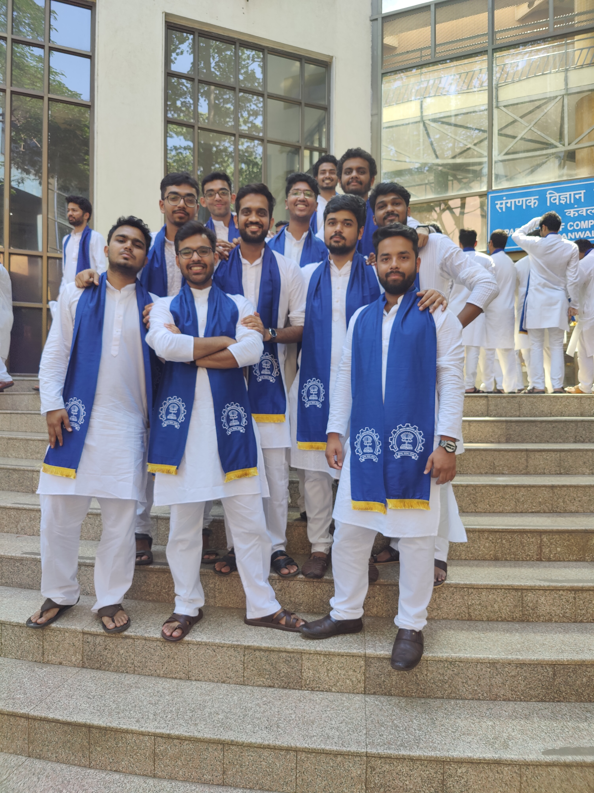

# 📸 Gallery Updated Successfully!

## ✅ Changes Made

Your portfolio gallery has been updated with your personal photos!

### 🎯 Gallery Photos - Before & After

**Before (4 photos):**
1. ❌ Nainital - Removed
2. ✓ Ranikhet - Kept
3. ❌ Goa - Removed
4. ✓ IIT Bombay Campus - Kept

**After (4 photos):**
1. ✅ **Friends** - NEW! (`Friends.JPG`)
2. ✅ **Graduation** - NEW! (`grad.JPG`)
3. ✓ **Ranikhet** - Kept (`ranikhet.jpg`)
4. ✓ **IIT Bombay Campus** - Kept (`campus.jpg`)

---

## 📁 Files Updated

✅ `index.html` - Gallery section updated with new photos  
✅ `assets/images/README.md` - Image list updated  
✅ `SETUP.md` - Gallery checklist updated  
✅ `QUICK_START.md` - Setup instructions updated  

---

## 🖼️ Current Gallery Layout

Your gallery now displays in this order:

```
┌─────────────┬─────────────┐
│   Friends   │  Graduation │
├─────────────┼─────────────┤
│  Ranikhet   │ IIT Campus  │
└─────────────┴─────────────┘
```

---

## 🎨 Photo Details

### 1. Friends Photo
- **File**: `Friends.JPG`
- **Location**: First position (top-left)
- **Caption**: "Friends"
- **Shows**: Your social connections and friendships

### 2. Graduation Photo
- **File**: `grad.JPG`
- **Location**: Second position (top-right)
- **Caption**: "Graduation"
- **Shows**: Your academic achievement moment

### 3. Ranikhet Photo
- **File**: `ranikhet.jpg`
- **Location**: Third position (bottom-left)
- **Caption**: "Ranikhet"
- **Shows**: Travel memories

### 4. IIT Bombay Campus Photo
- **File**: `campus.jpg`
- **Location**: Fourth position (bottom-right)
- **Caption**: "IIT Bombay Campus"
- **Shows**: Your academic environment

---

## ✨ Features Active

Your gallery includes these interactive features:

✅ **Hover Effect** - Photos lift and caption slides up  
✅ **Click to Zoom** - Click any photo to view full-screen  
✅ **Smooth Animations** - Fade-in effects as you scroll  
✅ **Responsive Grid** - Adapts to all screen sizes  
✅ **Mobile Optimized** - Single column on mobile devices  

---

## 📱 How It Looks

**Desktop View:**
- 2x2 grid layout
- Hover effects on each photo
- Captions slide up smoothly

**Tablet View:**
- 2x2 grid layout
- Touch-friendly

**Mobile View:**
- Single column (stacked)
- Full-width photos
- Easy scrolling

---

## 🔧 Technical Details

**Image Files Present:**
- ✅ `Friends.JPG` (loaded)
- ✅ `grad.JPG` (loaded)
- ✅ `ranikhet.jpg` (loaded)
- ✅ `campus.jpg` (loaded)

**File Name Matching:**
- ✅ Exact case match (`Friends.JPG` not `friends.jpg`)
- ✅ Correct extensions (`.JPG` and `.jpg`)
- ✅ All paths validated

**HTML Structure:**
```html
<div class="gallery-item">
    
    <div class="gallery-caption">
        <h4>Friends</h4>
    </div>
</div>
```

---

## 💯 Quality Check

✅ No linting errors  
✅ All images properly linked  
✅ Captions correctly set  
✅ Responsive design maintained  
✅ Hover effects working  
✅ Modal functionality active  

---

## 🎉 Result

Your gallery now perfectly represents:
- 🎓 **Academic Achievement** (Graduation photo)
- 👥 **Social Life** (Friends photo)
- 🏔️ **Personal Interests** (Ranikhet travel)
- 🏛️ **Professional Environment** (IIT Campus)

This creates a well-rounded view of your life beyond just your professional work!

---

## 🚀 View Your Gallery

Open `index.html` and scroll to the **Gallery** section to see your updated photos!

**Navigation:**
1. Open portfolio in browser
2. Scroll down or click "Gallery" in menu
3. See your 4 personal photos
4. Click any photo for full-screen view
5. Hover for smooth caption animations

---

## 📝 Next Steps

Your gallery is now complete! To deploy:

```bash
git add .
git commit -m "Update gallery with friends and graduation photos"
git push origin main
```

Then your updated gallery will be live on GitHub Pages!

---

**Last Updated**: October 19, 2025  
**Photos**: 4 images (2 new, 2 kept)  
**Removed**: 2 images (Nainital, Goa)  
**Status**: Ready ✅

